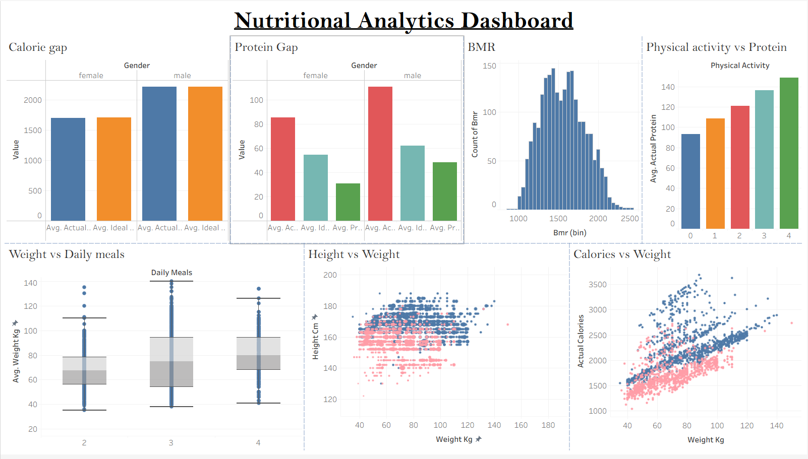

# Nutrition Analytics Data Pipeline & Dashboard

An end-to-end nutrition analytics project involving data preprocessing, ETL, cloud-based data processing, and interactive Tableau visualization.

## Tech Stack

**Python | Pandas | AWS S3 | AWS Glue | Amazon Athena | Tableau**

## Project Workflow

**Source Dataset → Python/Pandas ETL → Processed Dataset → AWS S3 → Athena → Tableau Dashboard**

## Dataset

The project uses a nutritional and fitness dataset containing information related to user demographics, meals, physical activity, body measurements, BMR, calorie intake, protein intake, and nutritional requirements.

The original dataset was sourced from Kaggle.

## Data Processing

Python and Pandas were used to process the data and derive analytical metrics including:

- Calorie intake
- Protein intake
- Calories burned
- Net calories
- Workout volume
- BMR
- Actual vs. ideal calorie intake
- Actual vs. ideal protein intake
- Calorie and protein gaps

## Dashboard

An interactive Tableau dashboard was developed to analyze:

- Actual vs. ideal calorie intake
- Actual vs. ideal protein intake
- Calorie and protein gaps
- BMR distribution
- Physical activity and protein intake
- Weight and meal patterns
- Height, weight, and calorie relationships

### Dashboard Preview



## Project Structure

```text
Nutrition-Analytics-Data-Pipeline/
│
├── README.md
│
├── source_data/
│   └── user_nutritional_data.csv
│
├── python_code/
│   └── main(1).py
│
├── output_data/
│   └── final.csv
│
└── dashboard/
    └── dashboard.twb
    └── dashboard_image.png
